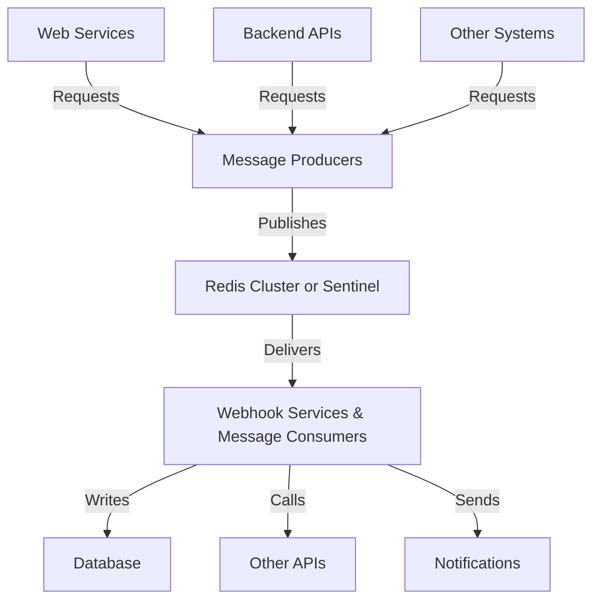

# Production Deployment

This guide covers best practices for deploying LeanMQ in production environments, including system architecture, monitoring, security, and operational considerations.

## Production Architecture

### System Components

A typical LeanMQ production deployment includes:

1. **Redis Infrastructure**:
   - Redis primary instance (or cluster)
   - Redis replicas for high availability
   - Redis Sentinel for automatic failover

2. **Message Producers**:
   - Your application services that send messages
   - Web API services that translate HTTP requests to messages

3. **Message Consumers**:
   - Dedicated worker processes that process messages
   - Webhook service instances

4. **Monitoring & Management**:
   - Redis monitoring tools
   - Queue monitoring services
   - Alerting systems

### Reference Architecture

Here's a reference architecture for a production deployment:



### Deployment Patterns

#### 1. Sidecar Pattern

Deploy webhook services as sidecars alongside your application:

```yaml
# Example Kubernetes deployment
apiVersion: apps/v1
kind: Deployment
metadata:
  name: my-service
spec:
  replicas: 3
  selector:
    matchLabels:
      app: my-service
  template:
    metadata:
      labels:
        app: my-service
    spec:
      containers:
      - name: application
        image: my-service:latest
        # ...
      - name: webhook-service
        image: leanmq-webhook-service:latest
        env:
          - name: REDIS_HOST
            value: "redis-master"
          - name: REDIS_PORT
            value: "6379"
          - name: WEBHOOK_PREFIX
            value: "myservice:"
```

#### 2. Dedicated Worker Pool

Run a pool of dedicated webhook workers:

```yaml
# Example Kubernetes deployment
apiVersion: apps/v1
kind: Deployment
metadata:
  name: webhook-workers
spec:
  replicas: 5
  selector:
    matchLabels:
      app: webhook-workers
  template:
    metadata:
      labels:
        app: webhook-workers
    spec:
      containers:
      - name: webhook-worker
        image: leanmq-webhook-worker:latest
        env:
          - name: REDIS_HOST
            value: "redis-master"
          - name: REDIS_PORT
            value: "6379"
          - name: WORKER_COUNT
            value: "4"  # Number of worker threads per pod
```

#### 3. Auto-scaling Workers

Set up auto-scaling based on queue length:

```yaml
# Example Kubernetes HPA
apiVersion: autoscaling/v2
kind: HorizontalPodAutoscaler
metadata:
  name: webhook-workers-hpa
spec:
  scaleTargetRef:
    apiVersion: apps/v1
    kind: Deployment
    name: webhook-workers
  minReplicas: 2
  maxReplicas: 10
  metrics:
  - type: External
    external:
      metric:
        name: redis_stream_length
        selector:
          matchLabels:
            stream: "webhook:orders"
      target:
        type: AverageValue
        averageValue: 100  # Scale up when more than 100 messages per pod
```

## Redis Setup

### Redis Configuration

Optimize Redis for LeanMQ:

```
# redis.conf

# Memory management
maxmemory 4gb
maxmemory-policy noeviction  # Don't evict data, return errors instead

# Persistence
appendonly yes
appendfsync everysec
no-appendfsync-on-rewrite yes
auto-aof-rewrite-percentage 100
auto-aof-rewrite-min-size 64mb

# Client connection settings
timeout 300
tcp-keepalive 60

# Performance tuning
io-threads 4  # For Redis 6+ with multi-threading
```

### High Availability

Set up Redis Sentinel for automatic failover:

```
# sentinel.conf

sentinel monitor mymaster redis-master 6379 2
sentinel down-after-milliseconds mymaster 5000
sentinel failover-timeout mymaster 60000
sentinel parallel-syncs mymaster 1
```

Implementation example:

```python
from redis.sentinel import Sentinel

# Connect to Redis Sentinel
sentinel = Sentinel([
    ("redis-sentinel-1", 26379),
    ("redis-sentinel-2", 26379),
    ("redis-sentinel-3", 26379)
], socket_timeout=0.1)

# Get the current master
master = sentinel.master_for("mymaster", socket_timeout=0.5)

# Create a factory function for LeanMQ
def get_redis_client():
    return sentinel.master_for("mymaster", socket_timeout=0.5)

# Use this in your application
# Note: You would need to modify LeanMQ to accept a client factory
```

### Persistence and Backup

Ensure proper Redis persistence and backup:

1. **Configure AOF (Append Only File)**:
   ```
   appendonly yes
   appendfsync everysec
   ```

2. **Regular backups**:
   ```bash
   # Backup script example
   #!/bin/bash
   DATE=$(date +%Y%m%d_%H%M%S)
   redis-cli -h redis-master -p 6379 SAVE
   cp /var/lib/redis/dump.rdb /backups/redis_backup_${DATE}.rdb
   # Optionally upload to cloud storage
   aws s3 cp /backups/redis_backup_${DATE}.rdb s3://mybucket/redis-backups/
   ```

3. **Backup verification**:
   ```bash
   # Verify backup integrity
   redis-check-rdb /backups/redis_backup_${DATE}.rdb
   ```

## Security Considerations

### Redis Security

1. **Authentication**:
   ```
   # In redis.conf
   requirepass strong_password_here
   ```

   In your LeanMQ configuration:
   ```python
   mq = LeanMQ(
       redis_host="redis-master",
       redis_port=6379,
       redis_password="strong_password_here"
   )
   ```

2. **Network security**:
   - Run Redis on a private network not exposed to the internet
   - Use firewall rules to restrict access
   - Consider using VPC or network policies in Kubernetes

3. **TLS encryption**:
   ```
   # In redis.conf (Redis 6+)
   tls-port 6380
   tls-cert-file /path/to/redis.crt
   tls-key-file /path/to/redis.key
   tls-ca-cert-file /path/to/ca.crt
   ```

### Message Security

1. **Sensitive data handling**:
   ```python
   def send_sensitive_message(webhook, path, data):
       # Don't include sensitive data directly in messages
       # Store it securely and pass a reference
       sensitive_data = {
           "credit_card": data.pop("credit_card"),
           "ssn": data.pop("ssn")
       }
       
       # Store sensitive data in secure storage with TTL
       secure_storage_id = store_in_secure_storage(sensitive_data)
       
       # Add reference to the message
       data["secure_data_ref"] = secure_storage_id
       
       # Send the message
       webhook.send(path, data)
   ```

2. **Data validation**:
   ```python
   from marshmallow import Schema, fields, validate

   class OrderSchema(Schema):
       order_id = fields.Str(required=True, validate=validate.Length(min=5, max=50))
       customer_id = fields.Str(required=True)
       amount = fields.Float(required=True, validate=validate.Range(min=0.01))
       status = fields.Str(validate=validate.OneOf(["pending", "processing", "shipped", "delivered"]))

   def send_validated_message(webhook, path, data):
       schema = OrderSchema()
       # Validate and strip unknown fields
       valid_data = schema.load(data)
       webhook.send(path, valid_data)
   ```

## Monitoring and Observability

### Queue Monitoring

Create a monitoring service:

```python
import time
import threading
import logging
import json
import os

class QueueMonitor:
    """Monitor LeanMQ queues and report metrics."""
    
    def __init__(self, mq, check_interval=60, alert_threshold=1000):
        """Initialize the queue monitor.
        
        Args:
            mq: LeanMQ instance
            check_interval: How often to check queues (seconds)
            alert_threshold: Message count to trigger alerts
        """
        self.mq = mq
        self.check_interval = check_interval
        self.alert_threshold = alert_threshold
        self.running = False
        self.thread = None
        self.logger = logging.getLogger("QueueMonitor")
        
    def start(self):
        """Start the monitoring thread."""
        if self.running:
            return
            
        self.running = True
        self.thread = threading.Thread(target=self._monitor_loop)
        self.thread.daemon = True
        self.thread.start()
        self.logger.info("Queue monitor started")
        
    def stop(self):
        """Stop the monitoring thread."""
        self.running = False
        if self.thread and self.thread.is_alive():
            self.thread.join(timeout=self.check_interval * 2)
        self.logger.info("Queue monitor stopped")
        
    def _monitor_loop(self):
        """Main monitoring loop."""
        while self.running:
            try:
                self._check_queues()
                time.sleep(self.check_interval)
            except Exception as e:
                self.logger.error(f"Error in monitoring: {e}")
                time.sleep(10)  # Short sleep on error
                
    def _check_queues(self):
        """Check all queues and report metrics."""
        try:
            queues = self.mq.list_queues()
            metrics = []
            
            for queue_info in queues:
                queue_type = "dlq" if queue_info.is_dlq else "queue"
                
                # Create metric data
                metric = {
                    "name": queue_info.name,
                    "type": queue_type,
                    "message_count": queue_info.message_count,
                    "pending_messages": queue_info.pending_messages,
                    "timestamp": time.time()
                }
                
                metrics.append(metric)
                
                # Check for issues
                if queue_info.message_count > self.alert_threshold:
                    self._send_alert(
                        f"Queue {queue_info.name} has {queue_info.message_count} messages",
                        "high" if queue_info.message_count > self.alert_threshold * 2 else "medium"
                    )
                    
                if queue_info.is_dlq and queue_info.message_count > 0:
                    self._send_alert(
                        f"DLQ {queue_info.name} has {queue_info.message_count} failed messages",
                        "high"
                    )
                    
                if queue_info.pending_messages > 100:
                    self._send_alert(
                        f"Queue {queue_info.name} has {queue_info.pending_messages} pending messages",
                        "medium"
                    )
                    
            # Export metrics
            self._export_metrics(metrics)
            
        except Exception as e:
            self._send_alert(f"Error checking queues: {e}", "high")
            raise
            
    def _export_metrics(self, metrics):
        """Export metrics to monitoring system.
        
        This is a placeholder. In a real implementation, you would send
        metrics to your monitoring system (Prometheus, Datadog, etc.)
        """
        # Log metrics
        self.logger.debug(f"Queue metrics: {json.dumps(metrics)}")
        
        # Example: Write to a file
        with open("/tmp/queue_metrics.jsonl", "a") as f:
            for metric in metrics:
                f.write(json.dumps(metric) + "\n")
                
        # Example: Export for Prometheus
        if os.path.exists("/metrics"):
            with open("/metrics", "w") as f:
                for metric in metrics:
                    name = metric["name"].replace(":", "_")
                    f.write(f'leanmq_queue_message_count{{queue="{name}",type="{metric["type"]}"}} {metric["message_count"]}\n')
                    f.write(f'leanmq_queue_pending_messages{{queue="{name}",type="{metric["type"]}"}} {metric["pending_messages"]}\n')
                    
    def _send_alert(self, message, severity="medium"):
        """Send an alert.
        
        This is a placeholder. In a real implementation, you would send
        alerts to your alerting system (PagerDuty, OpsGenie, etc.)
        """
        self.logger.warning(f"ALERT [{severity}]: {message}")
        
        # Example: Write to a file
        with open("/tmp/queue_alerts.log", "a") as f:
            f.write(f"{time.time()},{severity},{message}\n")
```

### Prometheus Metrics

Implement Prometheus metrics:

```python
from prometheus_client import Counter, Gauge, Histogram, start_http_server
import threading
import time

class LeanMQMetrics:
    """Prometheus metrics for LeanMQ."""
    
    def __init__(self, mq, port=8000):
        """Initialize metrics.
        
        Args:
            mq: LeanMQ instance
            port: Port for Prometheus HTTP server
        """
        self.mq = mq
        self.port = port
        
        # Define metrics
        self.messages_sent = Counter(
            "leanmq_messages_sent_total",
            "Total number of messages sent",
            ["queue"]
        )
        
        self.messages_received = Counter(
            "leanmq_messages_received_total",
            "Total number of messages received",
            ["queue"]
        )
        
        self.messages_acknowledged = Counter(
            "leanmq_messages_acknowledged_total",
            "Total number of messages acknowledged",
            ["queue"]
        )
        
        self.messages_moved_to_dlq = Counter(
            "leanmq_messages_moved_to_dlq_total",
            "Total number of messages moved to DLQ",
            ["queue", "reason"]
        )
        
        self.message_processing_time = Histogram(
            "leanmq_message_processing_seconds",
            "Time spent processing messages",
            ["queue"],
            buckets=(0.005, 0.01, 0.025, 0.05, 0.1, 0.25, 0.5, 1, 2.5, 5, 10)
        )
        
        self.queue_length = Gauge(
            "leanmq_queue_length",
            "Number of messages in queue",
            ["queue", "is_dlq"]
        )
        
        self.pending_messages = Gauge(
            "leanmq_pending_messages",
            "Number of pending messages",
            ["queue"]
        )
        
        # Start metrics server
        start_http_server(port)
        
        # Start monitoring thread
        self.running = True
        self.thread = threading.Thread(target=self._metrics_loop)
        self.thread.daemon = True
        self.thread.start()
        
    def _metrics_loop(self):
        """Continuously update queue metrics."""
        while self.running:
            try:
                # Update queue length metrics
                queues = self.mq.list_queues()
                for queue_info in queues:
                    self.queue_length.labels(
                        queue=queue_info.name,
                        is_dlq=str(queue_info.is_dlq).lower()
                    ).set(queue_info.message_count)
                    
                    self.pending_messages.labels(
                        queue=queue_info.name
                    ).set(queue_info.pending_messages)
            except Exception as e:
                print(f"Error updating metrics: {e}")
                
            time.sleep(15)  # Update every 15 seconds
            
    def stop(self):
        """Stop the metrics server."""
        self.running = False
        if self.thread and self.thread.is_alive():
            self.thread.join(timeout=30)
            
    # Methods to record metrics
    
    def record_message_sent(self, queue_name):
        """Record a message being sent."""
        self.messages_sent.labels(queue=queue_name).inc()
        
    def record_message_received(self, queue_name):
        """Record a message being received."""
        self.messages_received.labels(queue=queue_name).inc()
        
    def record_message_acknowledged(self, queue_name):
        """Record a message being acknowledged."""
        self.messages_acknowledged.labels(queue=queue_name).inc()
        
    def record_message_moved_to_dlq(self, queue_name, reason):
        """Record a message being moved to DLQ."""
        self.messages_moved_to_dlq.labels(queue=queue_name, reason=reason).inc()
        
    def time_message_processing(self, queue_name):
        """Time the processing of a message.
        
        Returns:
            A context manager that records the processing time.
        """
        return self.message_processing_time.labels(queue=queue_name).time()

# Usage example
metrics = LeanMQMetrics(mq, port=8000)

# Instrument your webhook handlers
@webhook.get("/order/status/")
def process_order_status(data):
    # Record message received
    metrics.record_message_received("order_status")
    
    # Time the processing
    with metrics.time_message_processing("order_status"):
        try:
            # Process the message
            process_order(data)
            
            # Record acknowledgment
            metrics.record_message_acknowledged("order_status")
        except Exception as e:
            # Record move to DLQ
            metrics.record_message_moved_to_dlq("order_status", str(e))
            raise
```

### Logging Best Practices

Implement structured logging:

```python
import logging
import json
import uuid
import time
import socket
import threading
from datetime import datetime

class StructuredLogger:
    """Logger that outputs structured JSON logs."""
    
    def __init__(self, service_name):
        """Initialize the structured logger.
        
        Args:
            service_name: Name of the service
        """
        self.service_name = service_name
        self.hostname = socket.gethostname()
        self.local = threading.local()
        
    def set_correlation_id(self, correlation_id=None):
        """Set correlation ID for the current thread."""
        if correlation_id is None:
            correlation_id = str(uuid.uuid4())
        self.local.correlation_id = correlation_id
        return correlation_id
        
    def get_correlation_id(self):
        """Get correlation ID for the current thread."""
        if not hasattr(self.local, "correlation_id"):
            self.set_correlation_id()
        return self.local.correlation_id
        
    def _create_log_record(self, level, message, **kwargs):
        """Create a structured log record."""
        timestamp = datetime.utcnow().isoformat() + "Z"
        
        record = {
            "timestamp": timestamp,
            "level": level,
            "message": message,
            "service": self.service_name,
            "hostname": self.hostname,
            "correlation_id": self.get_correlation_id()
        }
        
        # Add any additional fields
        record.update(kwargs)
        
        return json.dumps(record)
        
    def debug(self, message, **kwargs):
        """Log a debug message."""
        record = self._create_log_record("DEBUG", message, **kwargs)
        print(record)
        
    def info(self, message, **kwargs):
        """Log an info message."""
        record = self._create_log_record("INFO", message, **kwargs)
        print(record)
        
    def warning(self, message, **kwargs):
        """Log a warning message."""
        record = self._create_log_record("WARNING", message, **kwargs)
        print(record)
        
    def error(self, message, exception=None, **kwargs):
        """Log an error message."""
        if exception:
            kwargs["exception"] = str(exception)
            kwargs["exception_type"] = type(exception).__name__
            
        record = self._create_log_record("ERROR", message, **kwargs)
        print(record)
        
    def critical(self, message, exception=None, **kwargs):
        """Log a critical message."""
        if exception:
            kwargs["exception"] = str(exception)
            kwargs["exception_type"] = type(exception).__name__
            
        record = self._create_log_record("CRITICAL", message, **kwargs)
        print(record)

# Usage example
logger = StructuredLogger("webhook-service")

@webhook.get("/order/status/")
def process_order_status(data):
    # Set correlation ID based on message ID or create new one
    correlation_id = data.get("_correlation_id", str(uuid.uuid4()))
    logger.set_correlation_id(correlation_id)
    
    logger.info(
        "Processing order status update",
        order_id=data.get("order_id"),
        status=data.get("status")
    )
    
    try:
        # Process the message
        process_order(data)
        
        logger.info(
            "Successfully processed order status",
            order_id=data.get("order_id"),
            processing_time_ms=int((time.time() - start_time) * 1000)
        )
    except Exception as e:
        logger.error(
            "Error processing order status",
            exception=e,
            order_id=data.get("order_id"),
            status=data.get("status")
        )
        raise
```

## Operational Procedures

### Deployment

Standard deployment flow:

1. **Build and test**:
   ```bash
   # Run tests
   pytest tests/
   
   # Build packages
   python -m build
   ```

2. **Deploy with zero downtime**:
   ```bash
   # Assuming Kubernetes deployment
   kubectl apply -f webhook-service-deployment.yaml
   
   # Verify rollout
   kubectl rollout status deployment/webhook-service
   ```

3. **Post-deployment verification**:
   ```bash
   # Check logs
   kubectl logs -l app=webhook-service --tail=100
   
   # Check metrics
   curl http://webhook-service-metrics:8000/metrics
   ```

### Regular Maintenance

Perform regular maintenance tasks:

1. **Clean up old messages**:
   ```python
   def cleanup_old_messages(max_age_days=30):
       """Clean up messages older than specified age."""
       cutoff_time = time.time() - (max_age_days * 24 * 60 * 60)
       
       queues = mq.list_queues()
       for queue_info in queues:
           queue = mq.get_queue(queue_info.name)
           
           # Get all messages
           # Note: In a real implementation, you would process in batches
           messages = queue.get_messages(count=1000, block=False)
           
           # Find old messages
           old_message_ids = [
               msg.id for msg in messages
               if msg.timestamp < cutoff_time
           ]
           
           if old_message_ids:
               logger.info(f"Deleting {len(old_message_ids)} old messages from {queue_info.name}")
               queue.delete_messages(old_message_ids)
   ```

2. **Monitor and resize Redis**:
   ```bash
   # Check Redis memory usage
   redis-cli -h redis-master info memory | grep used_memory_human
   ```

3. **Verify backups**:
   ```bash
   # Test restore process periodically
   redis-cli -h redis-test flushall
   cat backup.rdb | redis-cli -h redis-test --pipe
   ```

### Troubleshooting

Common troubleshooting procedures:

1. **Check message processing**:
   ```python
   def check_queue_processing(queue_name):
       """Check if messages are being processed."""
       queue = mq.get_queue(queue_name)
       if not queue:
           print(f"Queue {queue_name} not found")
           return
           
       # Get queue info
       info = queue.get_info()
       print(f"Queue: {info.name}")
       print(f"Message count: {info.message_count}")
       print(f"Pending messages: {info.pending_messages}")
       
       # Check message processing speed
       if info.message_count > 0:
           # Sample a few messages to track processing
           messages = queue.get_messages(count=5, block=False)
           
           if messages:
               print(f"Sample message: {messages[0].data}")
               # Calculate age of oldest message
               oldest_timestamp = min(msg.timestamp for msg in messages)
               age_seconds = time.time() - oldest_timestamp
               print(f"Oldest message age: {age_seconds:.2f} seconds")
   ```

2. **Inspect DLQ messages**:
   ```python
   def inspect_dlq(queue_name):
       """Inspect messages in a DLQ."""
       dlq = mq.get_dead_letter_queue(queue_name)
       if not dlq:
           print(f"DLQ for {queue_name} not found")
           return
           
       # Get messages
       messages = dlq.get_messages(count=10, block=False)
       
       if not messages:
           print("No messages in DLQ")
           return
           
       print(f"Found {len(messages)} messages in DLQ")
       
       # Group by error
       errors = {}
       for msg in messages:
           error = msg.data.get("_error", "Unknown")
           if error not in errors:
               errors[error] = 0
           errors[error] += 1
           
       print("Error distribution:")
       for error, count in errors.items():
           print(f"  {error}: {count}")
           
       # Print sample message
       print("\nSample message:")
       print(json.dumps(messages[0].data, indent=2))
   ```

3. **Health check**:
   ```python
   def health_check():
       """Perform a comprehensive health check."""
       health = {"status": "healthy", "components": {}}
       
       # Check Redis connection
       try:
           ping = mq.mq._get_redis_client().ping()
           health["components"]["redis"] = {
               "status": "healthy" if ping else "unhealthy"
           }
       except Exception as e:
           health["components"]["redis"] = {
               "status": "unhealthy",
               "error": str(e)
           }
           health["status"] = "unhealthy"
           
       # Check queues
       try:
           queues = mq.list_queues()
           health["components"]["queues"] = {"status": "healthy", "details": {}}
           
           for queue_info in queues:
               queue_status = "healthy"
               
               # Check for issues
               if queue_info.is_dlq and queue_info.message_count > 0:
                   queue_status = "warning"
                   
               if queue_info.pending_messages > 100:
                   queue_status = "warning"
                   
               health["components"]["queues"]["details"][queue_info.name] = {
                   "status": queue_status,
                   "message_count": queue_info.message_count,
                   "pending_messages": queue_info.pending_messages
               }
               
               if queue_status == "warning" and health["status"] == "healthy":
                   health["status"] = "warning"
                   
       except Exception as e:
           health["components"]["queues"] = {
               "status": "unhealthy",
               "error": str(e)
           }
           health["status"] = "unhealthy"
           
       return health
   ```

## Next Steps

Now that you understand how to deploy LeanMQ in production, you can:

- Review [error handling strategies](./error-handling.md) for robust processing
- Learn about [scaling LeanMQ](./scaling.md) for high-volume applications
- Check the [API reference](../../reference/core.md) for detailed configuration options

Remember that a robust production deployment requires careful planning, monitoring, and maintenance. Start with a simple setup and evolve it as your needs grow.
